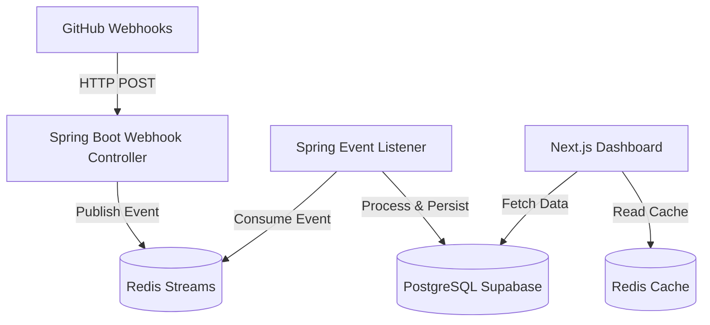

# LiveFolio (Event-Driven Edition)

Este repositório contém o código-fonte de um portfólio dinâmico projetado para refletir atividades de desenvolvimento em tempo real e gerenciar currículos com IA (CV Match), utilizando uma arquitetura orientada a eventos.

## 1. Visão Geral

O **LiveFolio** atua como um sistema de monitoramento que ingere, processa e projeta eventos do ecossistema GitHub, além de oferecer ferramentas administrativas para gestão de presença online e recrutamento.

### Objetivos do Projeto
1.  **Rastreabilidade em Tempo Real:** Visão imediata de commits e atividades via Webhooks.
2.  **Gestão de Currículos (CV Match):** Upload de PDFs, extração automática de skills e busca inteligente por compatibilidade.
3.  **Arquitetura de Event Sourcing:** Desacoplamento entre recepção de dados (Webhook) e exibição final.
4.  **Performance Analytics:** Estatísticas automáticas de produtividade e saúde do sistema.

## 2. Ciclo de Desenvolvimento

1.  **Ingestão:** Endpoint Webhook publica eventos em **Redis Streams**.
2.  **Processamento:** Worker assíncrono (Java/Spring Boot) consome e transforma os eventos brutos.
3.  **Persistência:** Dados processados são sincronizados no **PostgreSQL (Supabase)** e **Redis** (cache).
4.  **Interface:** Dashboard em **Next.js 14** com SSR para visualização instantânea.

## 3. Tecnologias e Ferramentas (Stack)

*   **Backend (Java 21 / Spring Boot 3):** Aplicação para performance em processamento e ingestão.
*   **Mensageria (Upstash Redis Streams):** Log de eventos assíncrono.
*   **Banco de Dados (Supabase/PostgreSQL):** Persistência relacional e histórico.
*   **Frontend (Next.js 14):** UI moderna com Tailwind CSS e Lucide Icons.
*   **Gestão de CV:** Extração de texto de PDF e matching baseado em dicionário de skills.

## 4. Estrutura do Projeto

```text
LiveFolio/
├── frontend/             # Aplicação Next.js (Dashboard e Painel Admin)
│   ├── app/              # Rotas: Activity, Stats, Admin (CV & Tracking)
│   ├── components/       # Componentes reutilizáveis (Sidebar, Status, etc)
│   └── lib/              # Clientes DB, Redis e Lógica de Negócio
└── java-backend/         # Core Backend (Java/Spring Boot)
    ├── src/main/java     # Lógica de Negócio, Webhook e Messaging
    └── pom.xml           # Dependências do Maven
```

## 5. Arquitetura do Backend



## 6. Execução

### Pré-requisitos
*   **Docker & Docker Compose**
*   **Contas Upstash (Redis) & Supabase (PostgreSQL)**
*   **Java 21 & Maven** (para desenvolvimento local)

### Passo a Passo

1.  **Configuração:** `cp .env.example .env` e preencha as credenciais.
2.  **Frontend (Next.js):**
    ```bash
    cd frontend
    npm install
    npm run dev
    ```
3.  **Backend (Java):** 
    ```bash
    cd java-backend
    mvn spring-boot:run
    ```

## 7. Funcionalidades Admin
Acesse `/admin/cv` para gerenciar:
- **Upload de CV:** Processamento automático de PDF.
- **Match de Vagas:** Extração de skills de descrições de vagas e busca dinâmica de candidatos.
- **Dicionário de Skills:** Configuração de termos de busca e cores para as tags.
- **Tracking:** Monitoramento de visitas e origem de tráfego.

## 8. Motivação e Escolhas Arquiteturais (Trade-offs)

*   **Redis Streams vs Kafka/RabbitMQ:** A escolha do **Redis Streams (via Upstash)** foi devido a simplicidade, facilidade de uso em ambientes serverless e baixa sobrecarga de infraestrutura, mantendo uma eficiência no processamento assíncrono de eventos do GitHub.
*   **Java Spring Boot para o Backend:** Apesar do frontend utilizar Next.js, se optou pelo **Java 21 e Spring Boot** no backend devido à sua performance, paralelismo com Virtual Threads e melhor capacidade na ingestão e processamento de dados dos webhooks.
*   **Supabase (PostgreSQL):** A escolha do **Supabase** para a persistência relacional se deu devido à configuração rápida, recursos prontos para uso e facilidade de integração em ambos os ambientes (Next.js e Java).

## 9. Desafios Enfrentados e Soluções

*   **Extração de Texto em PDFs Complexos:**
    *   *Desafio:* Durante a leitura de currículos para o CV Match, layouts variados quebravam a leitura estrutural convencional.
    *   *Solução:* Focar na normalização do texto e no uso de Regex com um dicionário de palavras-chave, extraindo skills da melhor forma independentemente da formatação.
*   **Sincronização entre Supabase e Cache:**
    *   *Desafio:* Garantir que a aplicação Next.js não exibisse dados obsoletos após o processamento de novos eventos pelo backend.
    *   *Solução:* Implementar uma lógica de invalidação e reconstrução direcionada do cache sempre que o Worker Java finaliza o processamento de um novo evento no banco.
*   **Falhas de Webhook ou Indisponibilidade Temporária:**
    *   *Desafio:* Lidar com eventuais quedas momentâneas do banco de dados e evitar a perda de eventos disparados pelo GitHub.
    *   *Solução:* Manter os eventos seguros na fila do Redis Streams, permitindo que o Worker realize retentativas e retome o processamento assim que a conexão se restabelecer.
